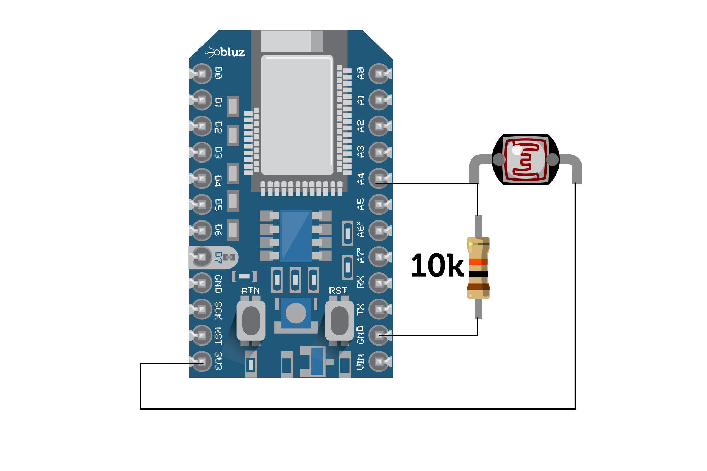

Day/Night Demo
==========

This demo shows basic cloud functionality between bluz and a very simple web app. The project is a demo/tutorial that we use to showcase internet connected hardware to various audiences. 

The web app is a simple page with a scene that originally appears in daytime. Bluz will be connected to a photoresistor and conected to the cloud, publishing the amount of light seen every 1 second. The web app will listen to the published events from bluz and adjust the images to match. By covering the photoresistor hooked to bluz, it changes the scene from daytime to nightime. By expsoing it to lots of light, it adjusts it back to daytime.

## Setup
You do need to setup the page before it can listen to events, mainly it needs an access token and device ID to listen to. To keep the page simple, there is only a login screen at the beginning if you haven't already set it up.

This dialog will accept the device ID and your access token. The device ID must be the Particle ID, the 24 character string, and not the name you assigned it. You can enter 'mine' (without quotes) if youw want the website to trigger on all your devices. However, if there are more than one device from an account performing this demo, they will interfere with eachother.

## Website
To open the website, you can simply open the index.html file in your browser. Alternatively, the website is current hosted at http://daynight.bluz.io/, so you can use that without having to download the files.

The

## Bluz Code
The code to run on bluz needs to be flashed down from the Particle Web IDE. The code can run on either a Particle Photon or bluz.

## Hardware
A photoresistor must be hooked up to bluz on analog pin A4, with a 10k pull-down resistor.

## Adjustments
Depending on the light on your surroundings, you may need to adjust the values in the bluz code. These are in the convertADC function, and there is one for bluz and one for the Photon.
